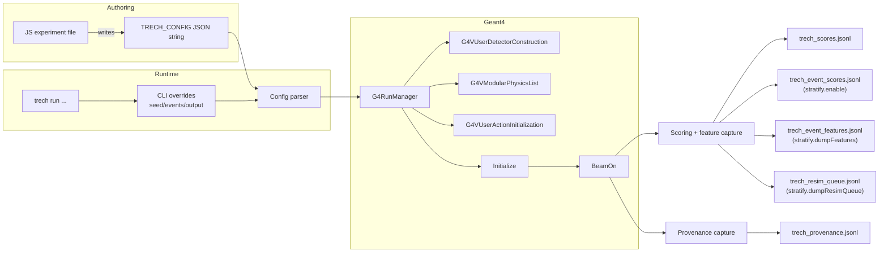
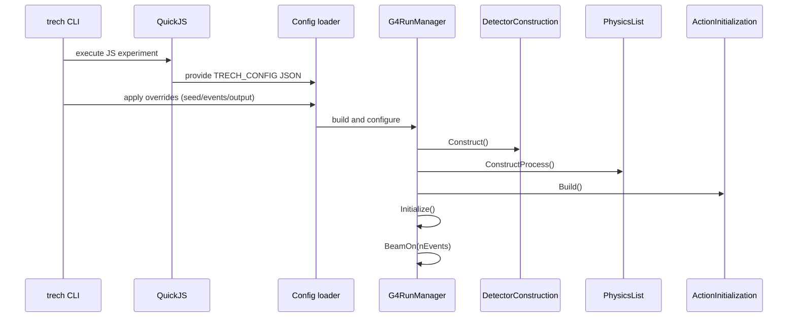
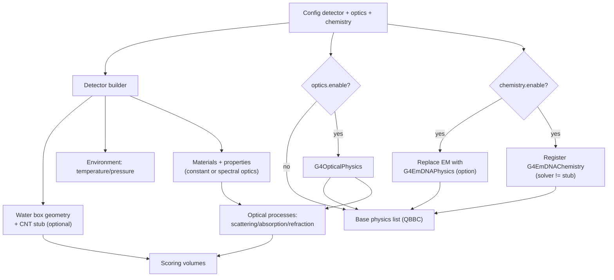
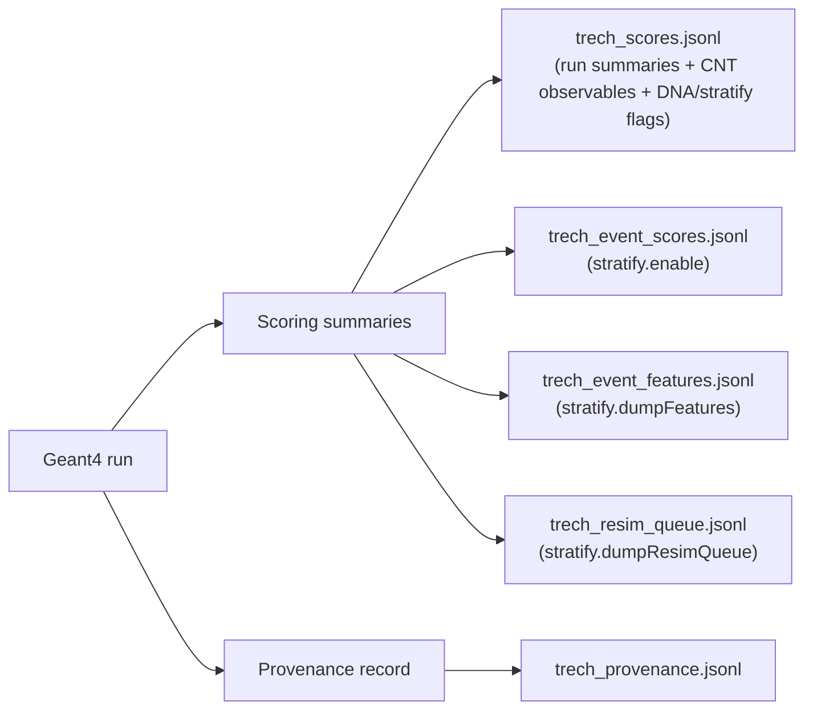
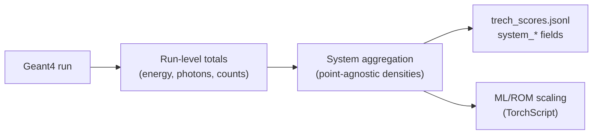
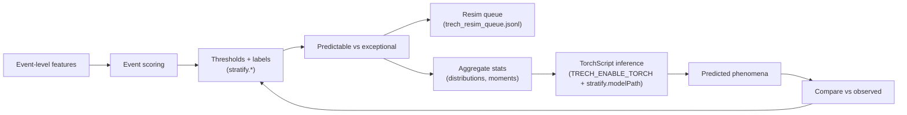
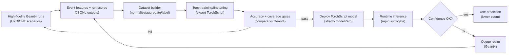
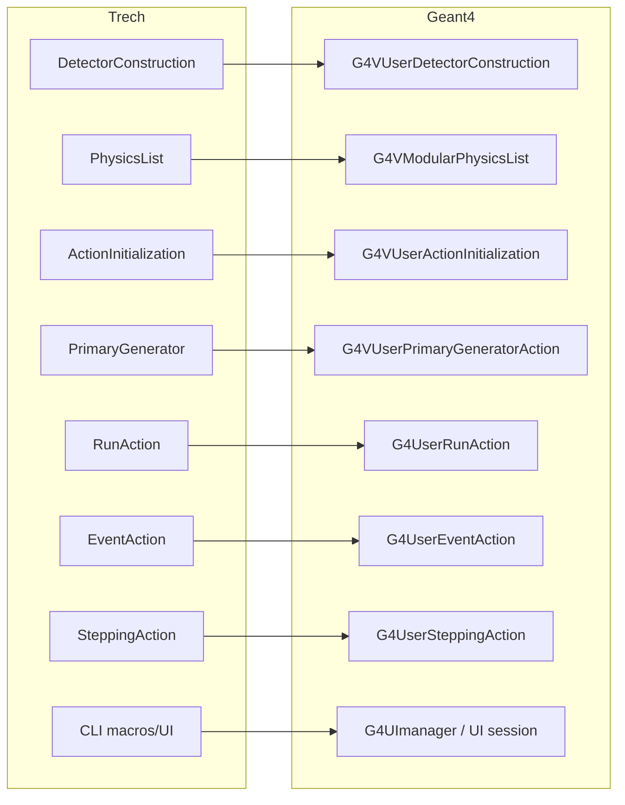

# CHARTS

Mermaid diagrams that capture TRECH dataflow, Geant4 wiring, outputs, and the
future stratification/prediction loop. Keep these in sync with runtime behavior
and config/output schema changes.

## End-to-end workflow (JS -> JSON -> Geant4 -> outputs)

## Geant4 lifecycle wiring (canonical order)

## Detector + physics assembly (optics + DNA path)

## Outputs + provenance (JSONL artifacts)

## System aggregation (point-agnostic ensemble layer)

## Event stratification + prediction loop (future-facing)

## Scale-up ML loop (Geant4 -> Torch training -> inference gate)

## TRECH -> Geant4 API mapping (where APIs are leveraged)

