# CHARTS

Mermaid diagrams that capture TRECH dataflow, Geant4 wiring, outputs, and the
future stratification/prediction loop. Keep these in sync with runtime behavior
and config/output schema changes.

## End-to-end workflow (JS or lab command stream -> Geant4 -> outputs)

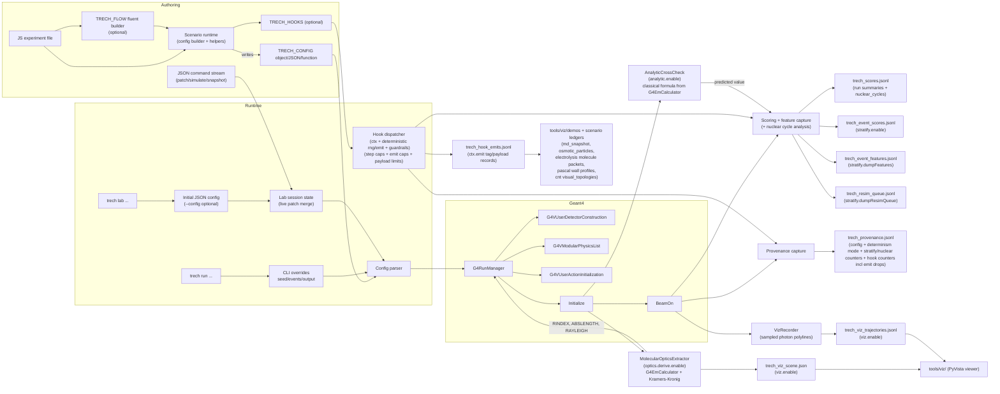
```mermaid
flowchart LR
  subgraph Authoring
    JS["JS experiment file"] --> FLOW["TRECH_FLOW fluent builder\n(optional)"]
    JS --> SCEN["Scenario runtime\n(config builder + helpers)"]
    FLOW --> SCEN
    SCEN -->|writes| CFG["TRECH_CONFIG object/JSON/function"]
    SCEN --> HOOKS["TRECH_HOOKS (optional)"]
    CMD["JSON command stream\n(patch/simulate/snapshot)"]
  end
  subgraph Runtime
    CLI["trech run ..."] --> OV["CLI overrides\nseed/events/output"]
    LABCLI["trech lab ..."] --> LABCFG["Initial JSON config\n(--config optional)"]
    CMD --> LABSESS["Lab session state\n(live patch merge)"]
    LABCFG --> LABSESS
    CFG --> PARSE["Config parser"]
    OV --> PARSE
    LABSESS --> PARSE
    HOOKS --> HOOKDISP["Hook dispatcher\n(ctx + deterministic rng/emit + guardrails)\n(step caps + emit caps + payload limits)"]
  end
  subgraph Geant4
    PARSE --> RM["G4RunManager"]
    RM --> DET["G4VUserDetectorConstruction"]
    RM --> PHY["G4VModularPhysicsList"]
    RM --> ACT["G4VUserActionInitialization"]
    RM --> INIT["Initialize"]
    INIT --> BEAM["BeamOn"]
  end
  BEAM --> SCORE["Scoring + feature capture\n(+ nuclear cycle analysis)"]
  BEAM --> PROV["Provenance capture"]
  HOOKDISP --> SCORE
  HOOKDISP --> PROV
  SCORE --> OUT1["trech_scores.jsonl\n(run summaries + nuclear_cycles)"]
  SCORE --> OUT2["trech_event_scores.jsonl\n(stratify.enable)"]
  SCORE --> OUT3["trech_event_features.jsonl\n(stratify.dumpFeatures)"]
  SCORE --> OUT4["trech_resim_queue.jsonl\n(stratify.dumpResimQueue)"]
  PROV --> OUT5["trech_provenance.jsonl\n(config + determinism mode + stratify/nuclear counters + hook counters incl emit drops)"]
  HOOKDISP --> OUT6["trech_hook_emits.jsonl\n(ctx.emit tag/payload records)"]
  OUT6 --> HOOKVIZ["tools/viz/demos + scenario ledgers\n(md_snapshot, osmotic_particles,\nelectrolysis molecule packets,\npascal wall profiles,\ncnt visual_topologies)"]
  INIT --> OPTDER["MolecularOpticsExtractor\n(optics.derive.enable)\nG4EmCalculator + Kramers-Kronig"]
  OPTDER -->|RINDEX, ABSLENGTH, RAYLEIGH| RM
  INIT --> ANACHK["AnalyticCrossCheck\n(analytic.enable)\nclassical formula from G4EmCalculator"]
  ANACHK -->|predicted value| SCORE
  BEAM --> VIZREC["VizRecorder\n(sampled photon polylines)"]
  OPTDER --> OUT7["trech_viz_scene.json\n(viz.enable)"]
  VIZREC --> OUT8["trech_viz_trajectories.jsonl\n(viz.enable)"]
  OUT7 --> PYVIZ["tools/viz/ (PyVista viewer)"]
  OUT8 --> PYVIZ
```

## Derived optics flow (composition -> n, abs, scat)

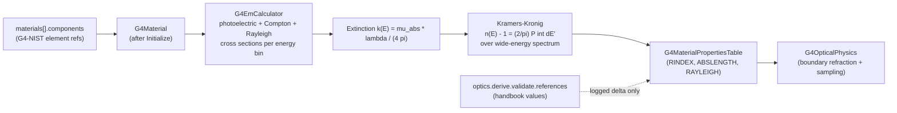
```mermaid
flowchart LR
  COMP["materials[].components\n(G4-NIST element refs)"] --> G4MAT["G4Material\n(after Initialize)"]
  G4MAT --> EMC["G4EmCalculator\nphotoelectric + Compton + Rayleigh\ncross sections per energy bin"]
  EMC --> EXT["Extinction k(E) = mu_abs * lambda / (4 pi)"]
  EXT --> KK["Kramers-Kronig\nn(E) - 1 = (2/pi) P int dE'\nover wide-energy spectrum"]
  KK --> MPT["G4MaterialPropertiesTable\n(RINDEX, ABSLENGTH, RAYLEIGH)"]
  MPT --> OPTPH["G4OpticalPhysics\n(boundary refraction + sampling)"]
  REF["optics.derive.validate.references\n(handbook values)"] -.->|logged delta only| MPT
```

## Analytic cross-check flow (classical formula vs Geant4 statistical result)

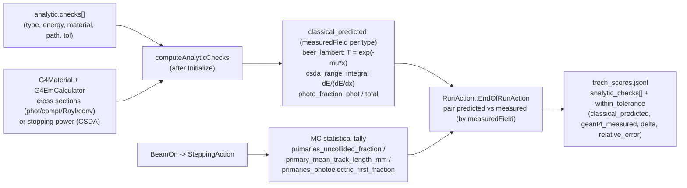
```mermaid
flowchart LR
  CFG["analytic.checks[]\n(type, energy, material, path, tol)"] --> ACC["computeAnalyticChecks\n(after Initialize)"]
  G4MAT2["G4Material + G4EmCalculator\ncross sections (phot/compt/Rayl/conv)\nor stopping power (CSDA)"] --> ACC
  ACC --> PRED["classical_predicted (measuredField per type)\nbeer_lambert: T = exp(-mu*x)\ncsda_range: integral dE/(dE/dx)\nphoto_fraction: phot / total"]
  BEAMON["BeamOn -> SteppingAction"] --> MEAS["MC statistical tally\nprimaries_uncollided_fraction /\nprimary_mean_track_length_mm /\nprimaries_photoelectric_first_fraction"]
  PRED --> CMP["RunAction::EndOfRunAction\npair predicted vs measured (by measuredField)"]
  MEAS --> CMP
  CMP --> OUT["trech_scores.jsonl\nanalytic_checks[] + within_tolerance\n(classical_predicted, geant4_measured, delta, relative_error)"]
```

## PubChem + Geant4 reaction/chemistry-inference scenario flow

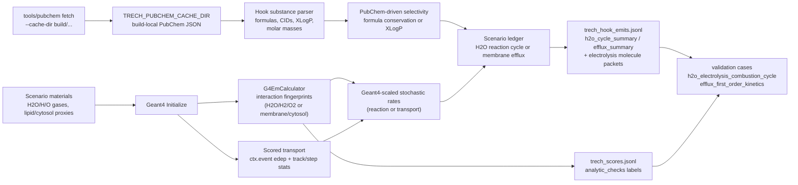
```mermaid
flowchart LR
  FETCH["tools/pubchem fetch\n--cache-dir build/..."] --> CACHE["TRECH_PUBCHEM_CACHE_DIR\nbuild-local PubChem JSON"]
  CACHE --> FORM["Hook substance parser\nformulas, CIDs, XLogP,\nmolar masses"]
  CFGMAT["Scenario materials\nH2O/H/O gases, lipid/cytosol proxies"] --> G4INIT["Geant4 Initialize"]
  G4INIT --> EMC2["G4EmCalculator\ninteraction fingerprints\n(H2O/H2/O2 or membrane/cytosol)"]
  G4INIT --> ETRAN["Scored transport\nctx.event edep + track/step stats"]
  EMC2 --> RATE["Geant4-scaled stochastic rates\n(reaction or transport)"]
  ETRAN --> RATE
  FORM --> SELECT["PubChem-driven selectivity\nformula conservation or XLogP"]
  SELECT --> LEDGER["Scenario ledger\nH2O reaction cycle or membrane efflux"]
  RATE --> LEDGER
  LEDGER --> EMITS["trech_hook_emits.jsonl\nh2o_cycle_summary / efflux_summary\n+ electrolysis molecule packets"]
  EMC2 --> SCORES["trech_scores.jsonl\nanalytic_checks labels"]
  EMITS --> VAL["validation cases\nh2o_electrolysis_combustion_cycle\nefflux_first_order_kinetics"]
  SCORES --> VAL
```

## CNT gate topology visualization flow

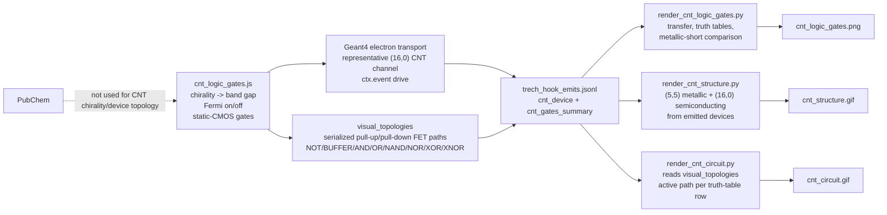
```mermaid
flowchart LR
  CNTJS["cnt_logic_gates.js\nchirality -> band gap\nFermi on/off\nstatic-CMOS gates"] --> G4CNT["Geant4 electron transport\nrepresentative (16,0) CNT channel\nctx.event drive"]
  CNTJS --> TOPO["visual_topologies\nserialized pull-up/pull-down FET paths\nNOT/BUFFER/AND/OR/NAND/NOR/XOR/XNOR"]
  G4CNT --> EMITCNT["trech_hook_emits.jsonl\ncnt_device + cnt_gates_summary"]
  TOPO --> EMITCNT
  EMITCNT --> PLOT["render_cnt_logic_gates.py\ntransfer, truth tables,\nmetallic-short comparison"]
  EMITCNT --> TUBES["render_cnt_structure.py\n(5,5) metallic + (16,0) semiconducting\nfrom emitted devices"]
  EMITCNT --> CIRCUIT["render_cnt_circuit.py\nreads visual_topologies\nactive path per truth-table row"]
  PLOT --> PNG["cnt_logic_gates.png"]
  TUBES --> GIF1["cnt_structure.gif"]
  CIRCUIT --> GIF2["cnt_circuit.gif"]
  PUBNA["PubChem"] -.->|"not used for CNT chirality/device topology"| CNTJS
```

## Geant4 lifecycle wiring (canonical order)

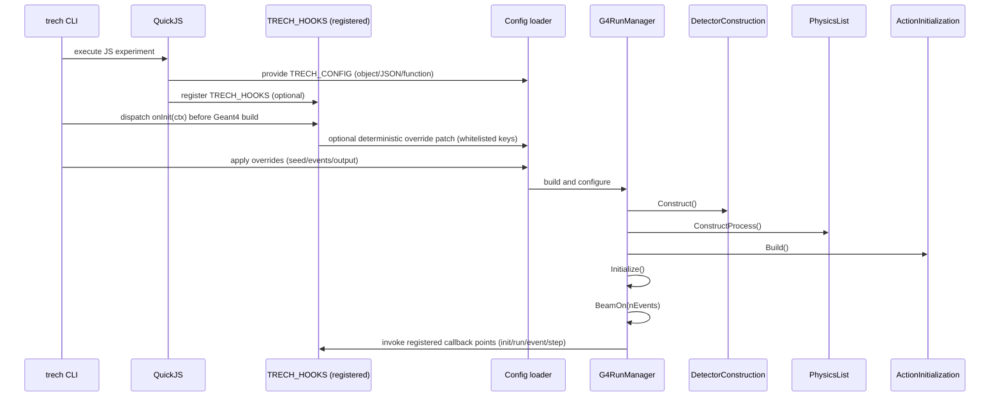
```mermaid
sequenceDiagram
  participant CLI as trech CLI
  participant QJS as QuickJS
  participant HOOK as TRECH_HOOKS (registered)
  participant CFG as Config loader
  participant RM as G4RunManager
  participant DET as DetectorConstruction
  participant PHY as PhysicsList
  participant ACT as ActionInitialization
  CLI->>QJS: execute JS experiment
  QJS->>CFG: provide TRECH_CONFIG (object/JSON/function)
  QJS->>HOOK: register TRECH_HOOKS (optional)
  CLI->>HOOK: dispatch onInit(ctx) before Geant4 build
  HOOK->>CFG: optional deterministic override patch (whitelisted keys)
  CLI->>CFG: apply overrides (seed/events/output)
  CFG->>RM: build and configure
  RM->>DET: Construct()
  RM->>PHY: ConstructProcess()
  RM->>ACT: Build()
  RM->>RM: Initialize()
  RM->>RM: BeamOn(nEvents)
  RM->>HOOK: invoke registered callback points (init/run/event/step)
```

## Real-time lab command loop (bootstrap path)

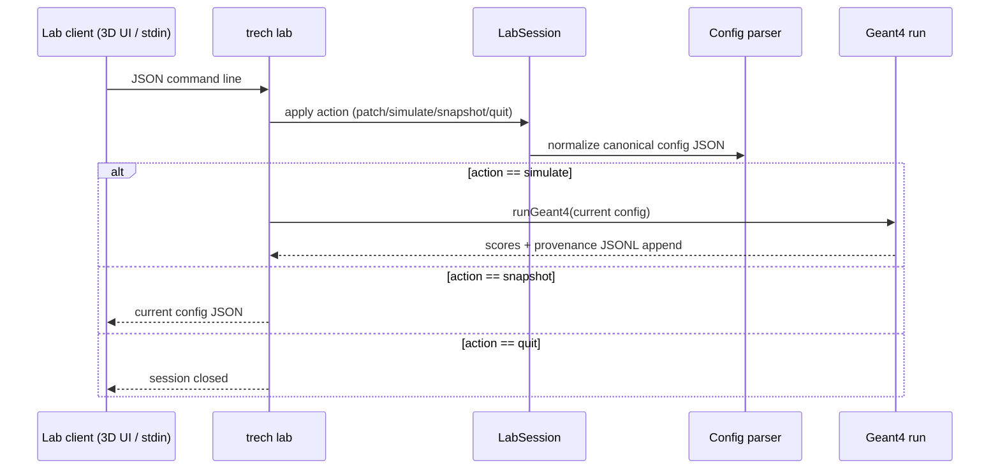
```mermaid
sequenceDiagram
  participant USER as Lab client (3D UI / stdin)
  participant CLI as trech lab
  participant LAB as LabSession
  participant CFG as Config parser
  participant G4 as Geant4 run
  USER->>CLI: JSON command line
  CLI->>LAB: apply action (patch/simulate/snapshot/quit)
  LAB->>CFG: normalize canonical config JSON
  alt action == simulate
    CLI->>G4: runGeant4(current config)
    G4-->>CLI: scores + provenance JSONL append
  else action == snapshot
    CLI-->>USER: current config JSON
  else action == quit
    CLI-->>USER: session closed
  end
```

## Detector + physics assembly (optics + DNA + nuclear-cycle path)

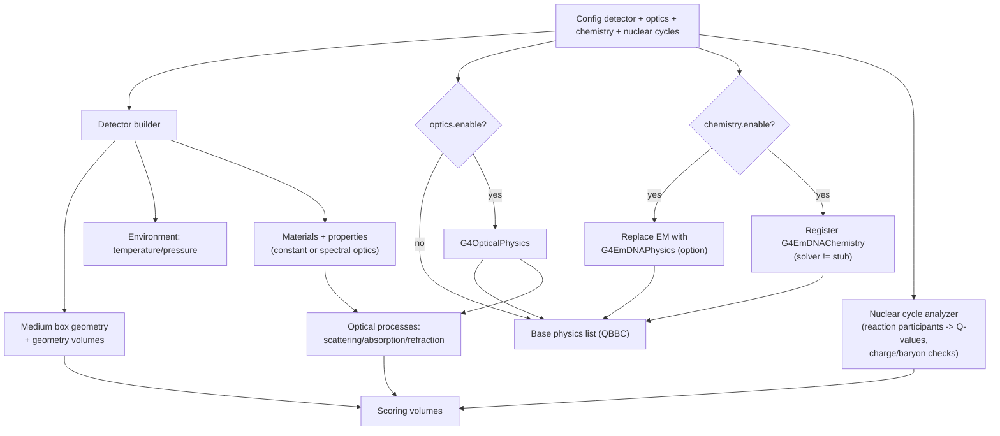
```mermaid
flowchart TB
  CFG["Config detector + optics + chemistry + nuclear cycles"] --> DETB["Detector builder"]
  DETB --> GEO["Medium box geometry\n+ geometry volumes"]
  DETB --> ENV["Environment: temperature/pressure"]
  DETB --> MAT["Materials + properties\n(constant or spectral optics)"]
  CFG --> OPT{optics.enable?}
  CFG --> CHEM{chemistry.enable?}
  OPT -- no --> PHYBASE["Base physics list (QBBC)"]
  OPT -- yes --> OPTPHYS["G4OpticalPhysics"]
  OPTPHYS --> PHYBASE
  CHEM -- yes --> DNAPHYS["Replace EM with\nG4EmDNAPhysics (option)"]
  CHEM -- yes --> DNACHEM["Register G4EmDNAChemistry\n(solver != stub)"]
  CFG --> NCYCLE["Nuclear cycle analyzer\n(reaction participants -> Q-values,\ncharge/baryon checks)"]
  DNAPHYS --> PHYBASE
  DNACHEM --> PHYBASE
  OPTPHYS --> OP["Optical processes:\nscattering/absorption/refraction"]
  MAT --> OP
  GEO --> SD["Scoring volumes"]
  OP --> SD
  NCYCLE --> SD
```

## Outputs + provenance (JSONL artifacts)

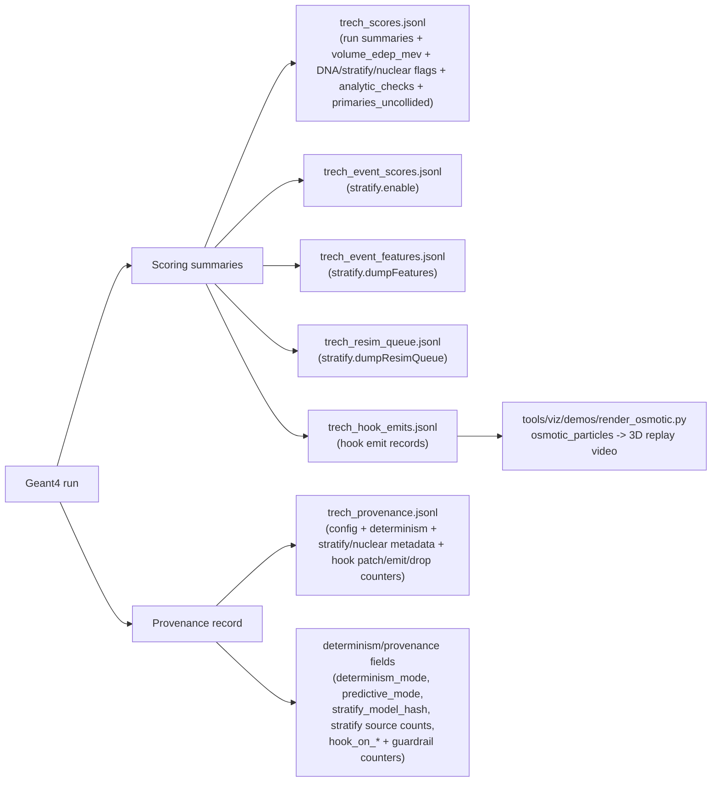
```mermaid
flowchart LR
  RUN["Geant4 run"] --> SCORING["Scoring summaries"]
  RUN --> PROV["Provenance record"]
  SCORING --> S1["trech_scores.jsonl\n(run summaries + volume_edep_mev + DNA/stratify/nuclear flags + analytic_checks + primaries_uncollided)"]
  SCORING --> S2["trech_event_scores.jsonl\n(stratify.enable)"]
  SCORING --> S3["trech_event_features.jsonl\n(stratify.dumpFeatures)"]
  SCORING --> S4["trech_resim_queue.jsonl\n(stratify.dumpResimQueue)"]
  SCORING --> S5["trech_hook_emits.jsonl\n(hook emit records)"]
  S5 --> V1["tools/viz/demos/render_osmotic.py\nosmotic_particles -> 3D replay video"]
  PROV --> P1["trech_provenance.jsonl\n(config + determinism + stratify/nuclear metadata + hook patch/emit/drop counters)"]
  PROV --> P2["determinism/provenance fields\n(determinism_mode, predictive_mode,\nstratify_model_hash, stratify source counts,\nhook_on_* + guardrail counters)"]
```

## System aggregation (point-agnostic ensemble layer)

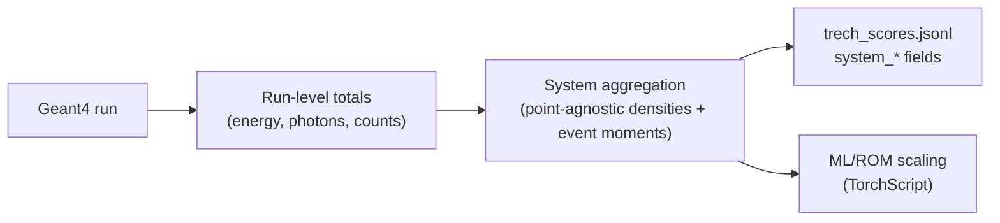
```mermaid
flowchart LR
  RUN["Geant4 run"] --> SCORE["Run-level totals\n(energy, photons, counts)"]
  SCORE --> SYS["System aggregation\n(point-agnostic densities + event moments)"]
  SYS --> OUTS["trech_scores.jsonl\nsystem_* fields"]
  SYS --> ML["ML/ROM scaling\n(TorchScript)"]
```

## Event stratification + prediction loop (future-facing)

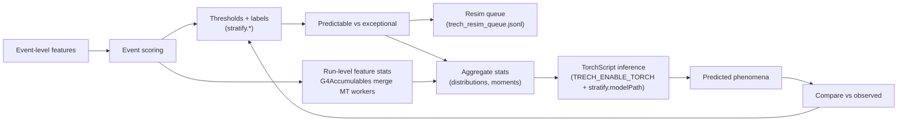
```mermaid
flowchart LR
  EVENTS["Event-level features"] --> SCORE["Event scoring"]
  SCORE --> THR["Thresholds + labels\n(stratify.*)"]
  SCORE --> RUNSTATS["Run-level feature stats\nG4Accumulables merge MT workers"]
  THR --> CLASS["Predictable vs exceptional"]
  CLASS --> RESIM["Resim queue\n(trech_resim_queue.jsonl)"]
  CLASS --> STATS["Aggregate stats\n(distributions, moments)"]
  RUNSTATS --> STATS
  STATS --> MODEL["TorchScript inference\n(TRECH_ENABLE_TORCH + stratify.modelPath)"]
  MODEL --> PRED["Predicted phenomena"]
  PRED --> COMP["Compare vs observed"]
  COMP --> THR
```

## Scale-up ML loop (Geant4 -> Torch training -> inference gate)

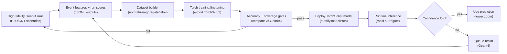
```mermaid
flowchart LR
  SIM["High-fidelity Geant4 runs\n(H2O/CNT scenarios)"] --> FEAT["Event features + run scores\n(JSONL outputs)"]
  FEAT --> DATA["Dataset builder\n(normalize/aggregate/label)"]
  DATA --> TRAIN["Torch training/finetuning\n(export TorchScript)"]
  TRAIN --> VALID["Accuracy + coverage gates\n(compare vs Geant4)"]
  VALID -- pass --> DEPLOY["Deploy TorchScript model\n(stratify.modelPath)"]
  VALID -- fail --> SIM
  DEPLOY --> INFER["Runtime inference\n(rapid surrogate)"]
  INFER --> CONF{"Confidence OK?"}
  CONF -- yes --> PRED["Use prediction\n(lower zoom)"]
  CONF -- no --> RESIM["Queue resim\n(Geant4)"]
  RESIM --> FEAT
```

## Geant4 -> training -> inference linkage (per prediction, per dimension scale)

How each of TRECH's most important learned predictions is produced: which
Geant4 experiments generate the training data, which trainer fits which model
(with its size), which gate decides promotion, and where the engine runs
inference — organized by the dimension scale each prediction operates at.
Shared dataset harvesting for all trainers/planners lives in
`tools/torch/trech_torch/dataset.py` (schemas locked to the C++ side:
`trech_event_features_v1` and `OpticsSurrogate::kCompositionElements`).

| Prediction | Dimension scale | Geant4 experiments executed (training data) | Trainer | Deployed model + size | Promotion gate | Inference site |
|---|---|---|---|---|---|---|
| Material refractive index n (residual over the f-sum extractor) | composition sampled at atomic scale (element mass fractions from Å-level cross sections) -> applied to photon transport at meso scale (mm-m slabs/cups) | `optics_training_panel.js` — one run derives optics for 15 materials via `G4EmCalculator` cross sections + Kramers-Kronig, emitting `element_mass_fractions` per material in `trech_viz_scene.json`; handbook anchors (`data/optics_handbook_anchors.json`) are targets only | `scripts/validate_optics_surrogate.py --export` (ridge); alt: `tools/torch/trech_torch/train_optics_surrogate.py` (MLP, TorchScript) | **ridge `.json`: 46 coefficients (~1.6 KB)** — `data/optics_surrogate_ridge.json`, LibTorch-free; MLP `.pt`: ~1.7k params (~19 KB), needs `TRECH_ENABLE_TORCH` | leave-one-out MAE vs the physics extractor (ridge LOO 0.084 < extractor 0.141 → promoted; the MLP fails this gate on the 15-material panel → not promoted) | `OpticsSurrogate` in `GeantRunner`, opt-in via `optics.derive.surrogateModelPath`: shifts the derived dispersion curve so transport's RINDEX uses the learned n |
| Event stratification (predictable vs exceptional -> resim gating) | per event, at whatever geometry scale the run uses (nm CNT channel to m-scale box); scale coverage of the training runs is recorded in the manifest | any run with `stratify.enable` + `stratify.dumpFeatures` (e.g. `config_stratify_ml.js`) — each event dumps the 7-feature `trech_event_features_v1` vector + a teacher label from the deterministic `stratify.*Threshold` rules (later: resim-confirmed labels) | `tools/torch/trech_torch/train_event_stratifier.py` (numpy logistic fit; TorchScript export from the same weights) | **logistic `.json`: 8 parameters + 14 scaler values (~1 KB)**, LibTorch-free; optional `.pt` twin (bit-parity ~1e-7) | held-out accuracy must beat the majority-class baseline (`beats_majority_baseline` in the manifest); engine additionally requires `determinism.mode: "predictive"` | `TorchScriptStub` json backend inside `EventStratifier` via `stratify.modelPath`; classified events feed `trech_event_scores.jsonl` (`source: "model"`) and the resim queue |
| Run/system observables (`system_*` densities, event moments) | run scale -> macro extrapolation substrate | every run (unconditional per-event feature accumulation; MT-merged via accumulables) | none — `OnlineEventStats` is Welford accounting, not a fitted model (optionally torch-tensor-backed) | n/a | n/a | run end: `event_feature_stats` + `system_*` in `trech_scores.jsonl`; the input surface for future ROM/fluid-scale models |

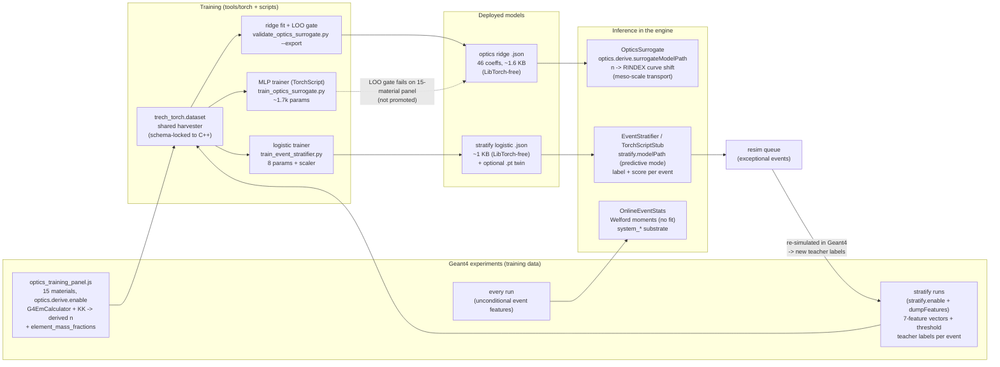
```mermaid
flowchart LR
  subgraph Geant4Experiments["Geant4 experiments (training data)"]
    PANEL["optics_training_panel.js\n15 materials, optics.derive.enable\nG4EmCalculator + KK -> derived n\n+ element_mass_fractions"]
    STRATRUNS["stratify runs\n(stratify.enable + dumpFeatures)\n7-feature vectors + threshold\nteacher labels per event"]
    ANYRUN["every run\n(unconditional event features)"]
  end
  subgraph Training["Training (tools/torch + scripts)"]
    HARVEST["trech_torch.dataset\nshared harvester\n(schema-locked to C++)"]
    RIDGE["ridge fit + LOO gate\nvalidate_optics_surrogate.py --export"]
    MLP["MLP trainer (TorchScript)\ntrain_optics_surrogate.py\n~1.7k params"]
    LOGI["logistic trainer\ntrain_event_stratifier.py\n8 params + scaler"]
  end
  subgraph Models["Deployed models"]
    RJSON["optics ridge .json\n46 coeffs, ~1.6 KB\n(LibTorch-free)"]
    LJSON["stratify logistic .json\n~1 KB (LibTorch-free)\n+ optional .pt twin"]
  end
  subgraph Inference["Inference in the engine"]
    OSUR["OpticsSurrogate\noptics.derive.surrogateModelPath\nn -> RINDEX curve shift\n(meso-scale transport)"]
    ESTR["EventStratifier / TorchScriptStub\nstratify.modelPath (predictive mode)\nlabel + score per event"]
    STATS["OnlineEventStats\nWelford moments (no fit)\nsystem_* substrate"]
  end
  PANEL --> HARVEST
  STRATRUNS --> HARVEST
  ANYRUN --> STATS
  HARVEST --> RIDGE --> RJSON --> OSUR
  HARVEST --> MLP -.->|"LOO gate fails on 15-material panel\n(not promoted)"| RJSON
  HARVEST --> LOGI --> LJSON --> ESTR
  ESTR --> RESIM["resim queue\n(exceptional events)"]
  RESIM -->|"re-simulated in Geant4\n-> new teacher labels"| STRATRUNS
```

### Learning what Geant4 must simulate next (active-learning planner)

The reverse link: `trech-plan-geant4-experiments`
(`tools/torch/trech_torch/plan_experiments.py`) reads the same harvested
datasets the trainers use, measures where the learned predictions are starved,
and emits a ranked machine-readable plan (`geant4_experiment_plan.json`) of
concrete simulation requests — closing the loop from model weakness back to
`trech run` commands.

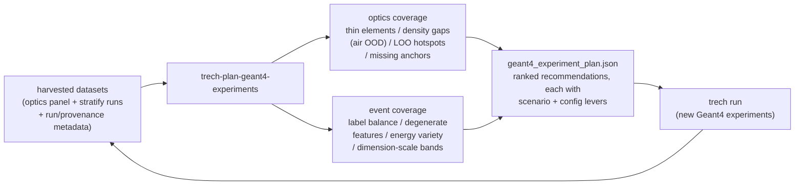
```mermaid
flowchart LR
  DATA["harvested datasets\n(optics panel + stratify runs\n+ run/provenance metadata)"] --> PLANNER["trech-plan-geant4-experiments"]
  PLANNER --> DIAG1["optics coverage\nthin elements / density gaps\n(air OOD) / LOO hotspots\n/ missing anchors"]
  PLANNER --> DIAG2["event coverage\nlabel balance / degenerate\nfeatures / energy variety\n/ dimension-scale bands"]
  DIAG1 --> PLAN["geant4_experiment_plan.json\nranked recommendations, each with\nscenario + config levers"]
  DIAG2 --> PLAN
  PLAN --> RUN["trech run <scenario>\n(new Geant4 experiments)"]
  RUN --> DATA
```

Dimension-scale bands used for coverage accounting (characteristic length from
`system_volume_mm3` / `detector.mediumBoxMm`): **atomic** (<1 nm, molecular
MD), **nano** (1 nm-1 um, CNT channels), **micro** (1 um-1 mm, cells/membranes),
**meso** (1 mm-1 m, lab bench), **macro** (>1 m). Each stratifier manifest
records which bands its training events came from, so deploying a model at an
uncovered scale is a visible extrapolation, not a silent one.

## Generic surrogate: Torch in ANY scenario (`models[]` + `ctx.predict`)

The two predictions above (optics n, event stratification) are hardwired
call-sites. The **generic surrogate** makes learned inference available to
*every* scenario — present or future — without new C++ per prediction. A
scenario declares named models in config and any hook calls them
deterministically; what a model predicts is defined entirely by the model
file's own named inputs/outputs, so the engine stays physics-agnostic.

- **Declare** (physics-agnostic config collection): `models: [{ name, path }]`
  — `path` points at a `GenericSurrogate`-loadable file (portable `.json`, or
  `.pt` with LibTorch). Normalized single-or-array, conditionally serialized,
  round-trip tested.
- **Call** (hook sideband): `ctx.predict(name, { feature: value, ... })` returns
  `{ outputName: value, ... }`. Unknown inputs default to 0, extras ignored, so
  scenarios pass whatever context they have. Deterministic (pure function of
  weights + numeric inputs); **disabled in strict mode** (returns `null`) and
  enabled in predictive mode, matching the determinism invariant; **logged** as
  `hook_predict_count` + `models_loaded` in scores/provenance.
- **Train** (any scenario's Geant4 outputs): `trech-train-surrogate` harvests
  named numeric columns from `trech_scores.jsonl` / `trech_event_features.jsonl`
  / `trech_hook_emits.jsonl` (`--source`/`--tag`), fits a linear (numpy) or MLP
  (torch) model with baked-in input/output standardisation, and exports the
  portable `generic_surrogate_v1` `.json` (+ optional `.pt`) plus a
  model-size/held-out-metrics manifest.

The `GenericSurrogate` C++ class (LibTorch-free JSON evaluator) subsumes the two
specialised loaders: it also reads `ridge_optics_n_v1` and
`logistic_stratifier_v1`, so the committed optics/stratifier models are callable
through the same `ctx.predict` path.

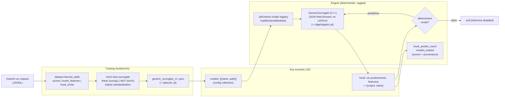
```mermaid
flowchart LR
  subgraph AnyScenario["Any scenario (JS)"]
    DECL["models: [{name, path}]\n(config collection)"]
    HOOK["hook: ctx.predict(name, features)\n-> {output: value}"]
  end
  subgraph Engine["Engine (deterministic, logged)"]
    REG["JsRuntime model registry\nloadDeclaredModels()"]
    GS["GenericSurrogate (C++)\nJSON feed-forward, no LibTorch\n(+ ridge/logistic/.pt)"]
    GATE{"determinism\nmode?"}
    PROV["hook_predict_count\nmodels_loaded\n(scores + provenance)"]
  end
  subgraph Training["Training (tools/torch)"]
    HARV["dataset.harvest_table\nscores | event_features | hook_emits"]
    TRAIN["trech-train-surrogate\nlinear (numpy) | MLP (torch)\nbaked standardisation"]
    JSON["generic_surrogate_v1 .json\n(+ optional .pt)"]
  end
  DECL --> REG --> GS
  HOOK --> GATE
  GATE -- predictive --> GS
  GATE -- strict --> NULLV["null (inference disabled)"]
  GS --> HOOK
  HOOK --> PROV
  GEANT["Geant4 run outputs\n(JSONL)"] --> HARV --> TRAIN --> JSON --> DECL
```

Because the harvester reads whatever a run emits (including arbitrary hook-emit
payloads by tag), a new scenario can define a novel observable, emit it, train a
surrogate for it, and consume the surrogate through `ctx.predict` — all without
touching the C++ engine. Demo: `examples/experiments/surrogate_generic_demo.js`.

## TRECH -> Geant4 API mapping (where APIs are leveraged)

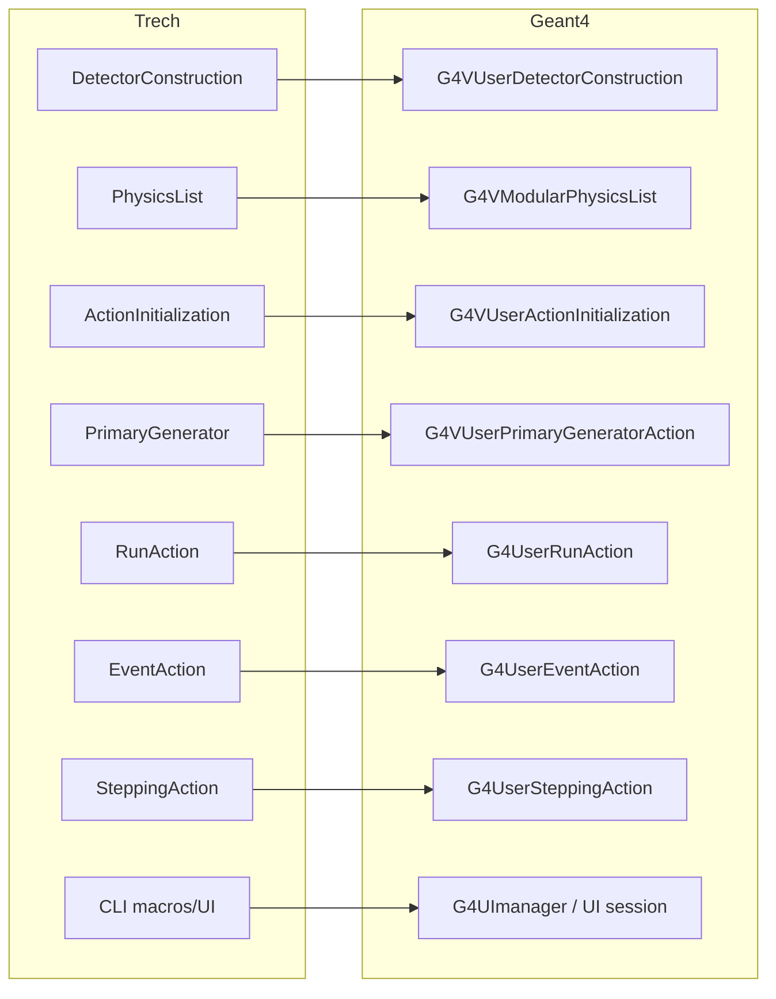
```mermaid
flowchart LR
  subgraph Trech
    T1["DetectorConstruction"]
    T2["PhysicsList"]
    T3["ActionInitialization"]
    T4["PrimaryGenerator"]
    T5["RunAction"]
    T6["EventAction"]
    T7["SteppingAction"]
    T8["CLI macros/UI"]
  end
  subgraph Geant4
    G1["G4VUserDetectorConstruction"]
    G2["G4VModularPhysicsList"]
    G3["G4VUserActionInitialization"]
    G4["G4VUserPrimaryGeneratorAction"]
    G5["G4UserRunAction"]
    G6["G4UserEventAction"]
    G7["G4UserSteppingAction"]
    G8["G4UImanager / UI session"]
  end
  T1 --> G1
  T2 --> G2
  T3 --> G3
  T4 --> G4
  T5 --> G5
  T6 --> G6
  T7 --> G7
  T8 --> G8
```
