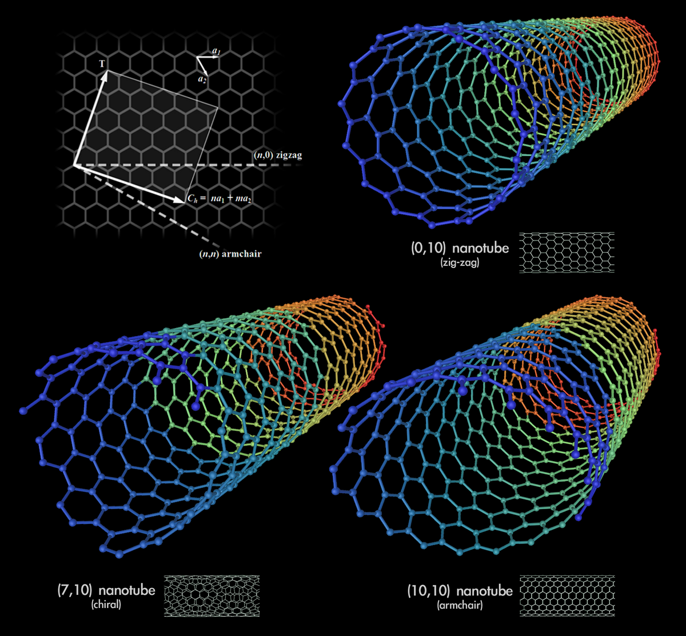

20 December 2025

# Back to the Carbon

Europe has a familiar weakness: we think in fragments while the world moves in systems. We argue over funding lines, national priorities, and procurement rules, while technology accelerates in directions that do not wait for our cohesion. This is not a moral failure; it is friction. But friction has a cost: we arrive late, we buy what others have already mastered, and we convince ourselves that “real” breakthroughs require a scale that only someone else can afford.

Silicon has carried us far, but it is no longer a wide road. We keep extracting progress by adding layers of complexity, by shrinking geometries into regimes where manufacturing becomes an exercise in near-ritual precision. It still works, but each step costs more, and each leap is harder. The question is not whether silicon will vanish tomorrow. The question is whether Europe wants to be a customer in the next foundation—or one of the authors.

Carbon offers a second foundation that is not a fantasy: it is a material we already know, but not yet fully domesticated for computing. And the story begins at a scale where intuition needs a new picture.

---

## A simple picture of how “nanoscale rules” work

At everyday scale, we imagine electrons as tiny particles flowing like beads in a wire. At nanoscale, that picture becomes incomplete, because electrons also behave like *patterns*—not because they are “vibrating for no reason,” but because nature links motion and wavelength. The faster an electron moves, the shorter its wavelength; the slower it moves, the longer the wavelength. This is not poetry: it is how quantum mechanics describes matter. You can think of the wavelength as the “spacing” of the pattern an electron makes as it moves.

Frequency enters the story through energy. Higher energy corresponds to faster oscillations in time, just as higher pitch corresponds to faster vibrations in a string. You don’t need to imagine a literal electron “wiggling” like a guitar string; the key idea is that, at nanoscale, electrons are described by wave-like patterns whose allowed shapes depend on geometry.

This is where graphene enters.

Graphene is a sheet of carbon atoms arranged in a perfect honeycomb. It is not only a strong sheet; it is an electronic landscape where electrons can move unusually freely. Now take that sheet and roll it into a cylinder so the edges meet and bond. You have formed a carbon nanotube.

That rolling step sounds simple, but the atomic lattice makes it precise. A honeycomb has directions, like fabric has a weave. When you roll the sheet, the seam can line up along different lattice directions. Each distinct seam is not a continuous “angle knob,” but a discrete choice set by the atomic grid. Physicists label it with two integers, (n,m), which specify exactly how the lattice wraps when the tube closes.

The decisive point is that rolling graphene is not like rolling a blank sheet of paper. It is like rolling a sheet of wallpaper with a repeating pattern: depending on how you align the pattern, the join can match perfectly—or it can meet with a deliberate offset.

In a nanotube, that “join” is not an arbitrary line. It is a **helical seam** written by the atomic lattice itself. In some tubes the seam closes in a way that preserves a strong left–right symmetry around the circumference, so the honeycomb pattern “meets itself” cleanly. In others, the seam twists like a spiral staircase: the lattice closes, but with a shifted alignment, as if one edge of the pattern meets the other half a unit higher. That microscopic asymmetry is visible as a different seam orientation, and it is not cosmetic—it is the definition of the tube.

Once the cylinder is closed, electrons are no longer free to choose any sideways motion. Around the circumference they must fit in allowed repeating patterns, like a rhythm that must return to its starting point after one lap. The seam decides which repeating patterns are permitted. If the permitted patterns line up with graphene’s naturally conductive states, the nanotube behaves like a metal: current flows easily. If the seam forces the allowed patterns to miss those conductive states, an **energy gap** appears: at low energy there is simply no allowed electronic pathway, and the tube behaves like a semiconductor—quiet until pushed “over the step” by voltage.

Diameter changes the spacing of these allowed patterns (bigger tubes pack the allowed states closer together; smaller tubes spread them out), but the main switch is the **wrapping symmetry** itself: the seam and the resulting atomic alignment around the ring.

Real tubes add one more twist: they are not always perfectly uniform cylinders. Strain, bends, slight “necking” or local radius changes can distort the lattice and modify behavior locally—sometimes opening small gaps, sometimes scattering electrons, sometimes creating weak points. But the fundamental classification that makes manufacturing hard—metallic populations mixed with semiconducting populations—still comes from chirality: the way the lattice closes, seam-first, into a ring.

> **Carbon nanotube geometry and conductivity (seam types).** A nanotube’s electrical behavior is largely set by how the graphene lattice “wraps” into a cylinder—visible as the orientation of the seam. **Armchair** tubes (seam aligned so the hexagons form an armchair pattern around the circumference) are typically **metallic**, offering continuous conduction pathways. **Zig-zag** tubes (seam aligned along the zig-zag rows) can be **metallic or semiconducting** depending on the exact atomic indices, so some conduct freely while others open an energy gap. **Chiral** tubes (seam tilted in a helical, spiral-like direction) most often behave as **semiconductors**, where the asymmetrical wrapping shifts the allowed electronic states and creates an energy gap that enables on/off switching.

---

## Why manufacturing creates the central problem

Here is the part that matters for industry: when we grow nanotubes in real reactors, we do not manufacture a single, chosen ((n,m)). We grow a population.

The nanotube begins on a catalyst particle. Carbon atoms attach, rings form, and a tube nucleates and elongates. In that early nucleation phase, tiny variations decide the tube’s diameter and the exact lattice seam that locks in. The process is statistical. The result is a forest containing different diameters and different chiralities—therefore a mixture of semiconducting tubes and metallic tubes born side by side.

This is why the “random generation” matters so much: even if only a minority are metallic, metallic nanotubes behave like invisible wires embedded inside a circuit you intended to be switchable. A single metallic pathway can short a transistor network, leak charge from memory, or destroy yield. So the practical challenge is not simply “build a nanotube transistor.” It is: how do we purify, sort, or neutralize the metallic tubes while preserving the semiconducting ones, and how do we do it repeatably at scale?

This is the kind of problem that does not surrender to a single clever paper. It requires an ecosystem that can try many approaches fast—optical, chemical, electrical, mechanical—and converge on what is robust, not merely what is publishable.

---

## The second barrier: the contact that decides whether the device is real

Even a perfect semiconducting nanotube can fail as a transistor if the interface to the metal electrode is wrong.

When two materials touch, electrons do not automatically flow. They “see” an energy landscape at the boundary. If the levels are misaligned, a barrier forms that blocks carriers. This is the Schottky barrier: it turns your carefully engineered channel into a reluctant device that behaves inconsistently across temperature, aging, and manufacturing variation.

This interface problem is where chemistry becomes destiny. Surface treatments, choice of contact metals, controlled doping, and process sequencing can lower the barrier and create ohmic-like contacts that behave as if the boundary isn’t there. Getting this right is not a detail; it is half the battle between a lab demo and a manufacturable platform.

---

## Europe’s opportunity is not a single factory. It is a research supply chain.

Europe already has brilliance. What it lacks is a low-friction way to turn scattered brilliance into cumulative momentum.

The usual answer is to write a framework: committees, documents, standards too early, and a procurement landscape that rewards compliance more than learning. The result is slow motion. But nanoscale technology advances by iteration. You need many small failures quickly, because each failure is information that narrows the path.

A more realistic European model is to build a research supply chain that behaves like production: a connected flow from synthesis to measurement to device integration to reliability testing to pilot manufacturing. Universities and public labs become neutral proving grounds, not “ivory towers,” where companies can test real modules under shared conditions. One group grows material. Another characterizes chirality distributions and electronic signatures. Another develops sorting or selective removal. Another studies contacts and stability. Another integrates into devices and measures yield. Industry doesn’t wait at the end; it co-designs the tests from the beginning, so the output is not only knowledge, but manufacturable recipes.

This kind of cohesion is not about everyone sharing everything. It is about sharing what must be shared: measurement methods, test conditions, interoperability of data, and validation protocols. What must remain protected—process details that create a competitive edge, thresholds, signatures, sensitive operational know-how—can be compartmentalized. Europe can be open where openness accelerates learning, and strict where strictness protects advantage. Both are required.

When this supply chain works, something subtle changes: experimentation becomes cheaper, not because it is trivial, but because it is distributed. A single lab does not need every instrument, every reactor, every microscope, every software stack. The network becomes the instrument. The cost of “one more attempt” drops, and with it the fear that slows progress. That is how you outlearn larger players without trying to outspend them.

---

## Patents are not vanity. They are geopolitical insulation.

If Europe wants strategic autonomy, it cannot rely only on buying finished technology. It must own parts of the recipe: the purification methods that turn mixed nanotube forests into reliable semiconducting populations; the contact chemistries that remove Schottky uncertainty; the process windows that keep devices stable over time; the metrology that proves quality at scale.

You do not need to replicate every mega-foundry on Earth to matter. But you do need intellectual property and deep know-how that others must license, partner for, or negotiate around. In a world where trade can fracture and supply chains can be weaponized, the most durable leverage is the ability to manufacture *capability*—and to do so without begging for permission.

Silicon is a technology we are still perfecting. Carbon is a technology we still have to tame. Europe’s choice is simple: remain a late customer of the next foundation, or become one of the places where that foundation is engineered—through a cohesive research supply chain that binds universities and industry into one continuous engine.

The future won’t be awarded to the loudest framework. It will belong to the systems that learn fastest, scale responsibly, and protect what they create—without suffocating the curiosity that created it in the first place.

---

Riccardo Cecchini (rcecchini.ds[at]gmail.com)
