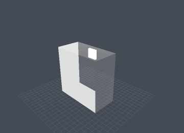
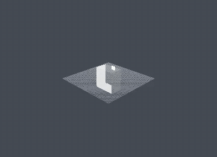
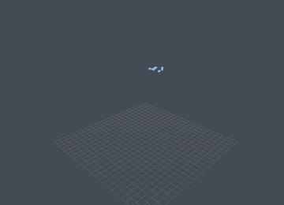
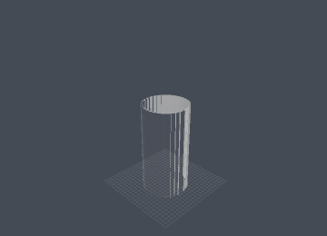

# TRECH Studio

A desktop app for TRECH: a **real-time 3D scenario editor**, a **simulation viewer**, and a
**scenario code editor** in one window. Studio is the observer-scale window onto the engine —
it runs scenarios, watches the macroscopic answers the engine inferred from the Geant4
particle/nano base, and lets you edit the scene that produced them.

> Studio is a **client, not a second physics engine.** Everything it draws comes from a real
> TRECH run or a live `trech lab` session, parsed from the documented outputs. See
> [`AGENTS.md`](AGENTS.md) for the honesty rules and [`ROADMAP.md`](ROADMAP.md) for status.

## Rendered by Studio

The same example scenarios shown in the [repo README](../README.md) — but drawn by **Studio's
own wgpu viewport** (offscreen capture path), not the bespoke demo renderers. These are the
scenarios Studio renders faithfully today: optics **trajectory** scenes, shaken-glass
**fluid particle** playback, and material-resolved observer frames. Each is a small committed
reference GIF under
[`tests/reference/`](tests/reference/) (regenerated only on demand — see below).

<table>
<tr>
<td width="50%" valign="top" align="center">
<br>
<b>Refraction</b><br>
A <b>glowing beam</b> of optical photons bends through a <b>see-through</b> glass slab into water.
The beam is the run's real trajectories (wavelength→RGB, additive glow); air/water/glass and
boundary-vs-scatter labels come from Geant4, so a bend is never guessed to be scattering. The glass look — clear
body, Fresnel-defined edges — is <b>derived from the run's Geant4 optics</b> (refractive index →
reflectivity, Beer–Lambert → transparency), not painted on.
</td>
<td width="50%" valign="top" align="center">
<br>
<b>Glass of water</b><br>
Strict single-photon optics through a glass cup of water — Studio's take on the repo's
<a href="../README.md">glass-of-water beam</a> demo. The photon beam grows on the engine's
per-step <code>time_ns</code> clock, bending as it enters and leaves the clear cup.
</td>
</tr>
<tr>
<td width="50%" valign="top" align="center">
<br>
<b>Shaken glass of water</b><br>
The cascade hero: ~4,300 <code>fluid_frame</code> particles poured + shaken. Studio scrubs the
emitted frames as <b>camera-facing sprite billboards</b> — an upright body of water that fills and
sloshes in the glass (the repo's metaball isosurface is a bespoke renderer; a compute-metaball
overlay in Studio is <a href="ROADMAP.md">ROADMAP M3</a>).
</td>
<td width="50%" valign="top" align="center">
<br>
<b>Water + n-pentane beaker</b><br>
Geant4 material/optics facts plus a two-stage cascade infer two colourless phases, the
lower-density n-pentane layer above water, and 7.73% evaporation over 60 minutes. Studio holds
the 61 emitted <code>material_frame</code>s without interpolation. Blue/gold are explicitly
labelled <b>representation-only tints</b> from
<code>beaker_water_n_pentane_studio.js</code>; they expose the otherwise colourless interface and
never feed the inferred layout or evaporation.
</td>
</tr>
</table>

> Honest scope: every pixel is Studio's render of engine output on the engine's clock; the slow
> turntable, trajectory/fluid colours, and explicitly labelled beaker phase tints are the only
> rendering choices. Scenarios whose
> output is a bespoke 2D plot (g(r), D(T), MRI, CNT band structure) are **not** shown here —
> Studio's 3D viewport does not reproduce them, and an empty stage would be dishonest.

## Precision is part of the view

Studio reports simulation and representation precision separately. The preview status/console
and world inspector show Monte-Carlo event count, trajectory samples/caps, medium/process-label
coverage and native segment/frame resolution. A weak sampled optical beam is deliberately tight
and translucent; overlapping photons build width/brightness, and air paths remain labelled while
rendering finer and fainter than paths in water/glass. Only a recorded Geant4 scatter process gets
scatter emphasis.

Every headless render writes the same structured report to its JSON sidecar, together with output
pixels, supersampling, hold/prefix policy and other display choices. Coordinates, time and
material-frame RGBA stay engine-owned; ribbon/sprite width and alpha stay labelled representation.
Preview and capture disclose loaded-vs-recorded trajectory counts and whether the exact segment
budget truncated any engine samples.

For live labs, the engine also emits planned rounds, measured wall time and achieved Hz. The
round count adapts online, and compatible batches reuse one initialized Geant4 kernel. The UI must
still show measured `achieved_hz`, not imply that a planned count achieved 60 Hz. Geometry, beam,
physics, scoring, or output edits after initialization currently require an explicit lab restart;
the reinitialize/restart UX remains tracked work.

## Scenario options

A JavaScript scenario can expose only the values it intends users to tune with
`TRECH_VALUE.number`, `integer`, `boolean`, `string`, or `choice`. Studio asks the engine's
Geant4-free `trech inspect` command to evaluate those declarations, then builds grouped native
controls in the right-side **Options** panel. Pressing Run sends the selected JSON values back as
validated `--param` arguments. Studio does not parse JavaScript or infer which constants are safe
to edit; ordinary TRECH runs use each declaration's default.

The shipped `viz_refraction_demo.js`, `h2o_fluid.js`, and `config_cnt_stub.js` examples expose
representative sizes/levels, temperatures, source settings, and sampling levels.

## Stack

- **PySide6 (Qt 6)** — dockable editor shell (viewport, outliner, inspector, console, code editor)
- **wgpu-py (WebGPU)** — WGSL shaders → **Vulkan** on Linux/Windows, **Metal** on macOS, via `naga`
- **numpy** — camera + mesh math

No OpenGL (deprecated on macOS), no hand-managed MoltenVK, no per-platform graphics branch.

## Install & run

```bash
cd studio
python -m venv .venv && source .venv/bin/activate
pip install -e .
python -m trech_studio            # launch (or: trech-studio)
```

Open an existing run directly:

```bash
python -m trech_studio --open ../build/dev/out_viz_refraction
```

Studio finds the engine binary via `$TRECH_BIN`, else the repo-relative `build/**/trech`
(currently `build/dev/trech`). If wgpu can't initialise a GPU, the app still launches with a
message in place of the viewport so you can edit code and inspect outputs.

## Layout

```
trech_studio/
  __main__.py        # entry: python -m trech_studio
  app.py             # QApplication + main window bootstrap
  capture.py         # headless offscreen capture: run -> PNG + MP4/GIF (python -m trech_studio.capture)
  precision.py       # simulation counts/caps/errors + representation/raster precision report
  settings.py        # engine path, viewport defaults
  engine/            # the ONLY code that talks to the engine binary
    locator.py       #   find build/**/trech (or $TRECH_BIN)
    parameters.py    #   `trech inspect` → typed TRECH_VALUE metadata
    runner.py        #   `trech run exp.js --output dir` (QProcess, streamed)
    lab.py           #   `trech lab` bridge (snapshots + adaptive-round telemetry)
    outputs.py       #   parse an output dir → typed run results
  scene/             # the editable scenario model
    model.py         #   SceneModel (world, volumes, materials, beams, run)
    loader.py        #   trech_viz_scene.json → SceneModel
  render/            # wgpu real-time viewport (pure rendering)
    camera.py mesh.py viewport.py renderer.py
    playback.py      #   medium/process trajectories + fluid/material frames for the timeline
    shaders/surface.wgsl shaders/lines.wgsl shaders/vertex_color.wgsl
  ui/                # PySide6 panels (glue only)
    main_window.py outliner.py inspector.py scenario_options.py code_editor.py console.py theme.py
    scenarios.py     #   left-sidebar scenario tree (defaults to examples/)
    timeline.py      #   playback bar scrubbing the animation preview
tests/               # headless unit tests (playback + appearance + offscreen Qt + capture/animation)
  reference/         #   committed compact "rendered by Studio" GIFs (gated; see its README)
run_examples_suite.sh # run the example scenarios + capture PNG/MP4/GIF for validation
```

Layering rule: `ui → scene/engine/render`, never the reverse. See [`AGENTS.md`](AGENTS.md).

## Scenario tree + timeline

The left sidebar has a **Scenarios** tree rooted at `examples/` — the shipped experiment
scenarios double as Studio's test suite for opening and rendering complex runs. Double-click a
scenario to open it in the code editor; if it has a previous Studio run, that run loads too.
"Add folder…" adds your own scenario folders.

The bottom **Timeline** bar plays back a loaded run's animation preview in the viewport: for
trajectory runs it grows the sampled photon/particle polylines along the engine's per-step
`time_ns`; for particle-family runs (e.g. the shaken glass of water's `fluid_frame` emits) it
scrubs the emitted frames. `material_frame` adds per-particle engine RGBA in millimetres (used by
the water/n-pentane 60-minute beaker). Everything shown is engine output replayed on the engine's
own clock; frames are held, not interpolated.

## Examples capture suite (for AI / human validation)

`run_examples_suite.sh` runs the example scenarios through the engine, then renders **each
run's Studio viewport** (scene + timeline playback) offscreen to a still **PNG** and an
**MP4 + GIF**, and writes a `manifest.json` + `index.md` so a human or an AI can check that
Studio handles each complex scenario and renders it correctly. It uses Studio's own wgpu
renderer (`trech_studio.capture`) — the real viewport path — and `ffmpeg` for encoding.

```bash
studio/run_examples_suite.sh --list                     # show the scenario table
studio/run_examples_suite.sh                            # default set (fast+medium), PNG+MP4+GIF
studio/run_examples_suite.sh --still viz_refraction glass_shaken   # only these, PNG only
studio/run_examples_suite.sh --all                      # add the slow MD/fluid scenarios
studio/run_examples_suite.sh --no-run cnt_band          # re-render an existing run only
```

Output lands in `build/studio/examples_suite/` (`captures/<id>.{png,mp4,gif,json}` +
`index.md` + `manifest.json`). Capture a single run directly with
`python -m trech_studio.capture --run <dir> --out <prefix>`. Everything degrades gracefully:
no GPU → JSON sidecar only; no ffmpeg → still PNG via a built-in encoder.

To refresh the committed **reference GIFs** shown above, add `--update-refs` (or
`TRECH_STUDIO_UPDATE_REFS=1`); it promotes a curated small subset into
[`tests/reference/`](tests/reference/). It's **off by default** so the repo isn't churned with
binary diffs on every run. A one-off compact GIF:
`python -m trech_studio.capture --run <dir> --reference tests/reference/<id>.gif`.

## Status

Basis / skeleton (2026-07-11): app shell, panels, engine locator/runner/lab bridge, output
parsing, scene model + loader, camera, mesh gen, and a wgpu viewport that draws lit volumes +
a grid are implemented. Added 2026-07-12: the **scenario browser**, the **timeline** with
trajectory + particle-frame playback in the viewport, and the **examples capture suite**
(offscreen PNG/MP4/GIF). Added 2026-07-13: **physics-derived material appearance** (transparency
from Beer–Lambert, reflectivity from Fresnel(n), a CIE transmission tint — glass renders
transparent + glossy straight from the Geant4 optics), an authored `viz_*` render-hint channel,
and the gated **reference GIFs** shown above. Fixed 2026-07-13: fluid clouds are remapped
z-up→y-up (the shaken glass stood on its side before), particle frames draw as camera-facing
sprite billboards (an upright body of water, not sparse dots), the camera frames the placed
volumes so the subject fills the frame, and the capture supersamples + builds the GIF from
lossless frames (no more background speckle). **Optics made legible (same day):** photon
trajectories render as glowing beam ribbons and clear glass renders see-through, so the beam reads
*through* the container; an authored `viz_shell` hint forces a clear glass shell for emphasis
(a "forced parameter, easy to disable"). **Added 2026-07-15:** medium/process-exact optical
playback, weak-beam intensity styling, preview/capture precision reports, per-particle RGBA
`material_frame` playback, adaptive lab-round telemetry, and true annular tube meshes (so a
beaker stays hollow). Typed `TRECH_VALUE` scenario controls now populate the right-side Options
panel through real engine inspection and feed validated selections back into batch runs. The
property-driven visual editor, gizmos, and
`SceneModel → .js` serialisation remain scaffolded — tracked in [`ROADMAP.md`](ROADMAP.md).
