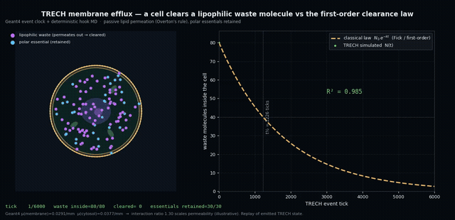
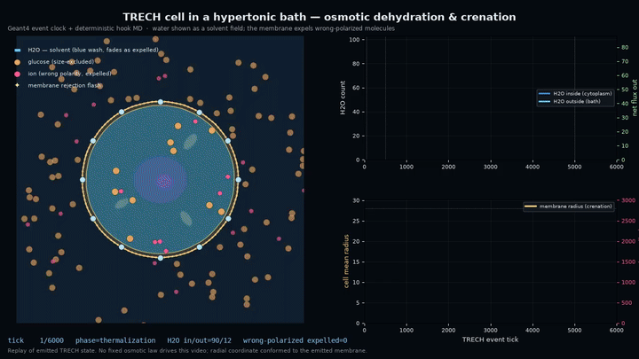

# trech-viz demos

Reproducible, scripted illustrations of TRECH scenarios, captured as mp4.

The interactive `trech-viz` CLI (one level up) renders TRECH output
faithfully — actual `trech_viz_trajectories.jsonl` polylines, derived
optical constants for tinting, etc. The scripts in this directory are
*illustrations*: they read the scene to recover geometry, but may
synthesise the photon path or override material colours to make the
underlying physics easy to see in a six-second clip suitable for docs /
talks / PRs.

## Prerequisites

- `tools/viz` installed in a venv — see [`../README.md`](../README.md).
- `ffmpeg` on `$PATH`.
- A TRECH run for the relevant scenario, so the script has a scene file
  to read geometry from.

## glass\_of\_water\_beam.mp4 — physics target vs TRECH simulation

[`render_glass_of_water.py`](render_glass_of_water.py) animates a 2.25 eV
(green) photon crossing the
[`validation_glass_of_water`](../../../examples/experiments/validation_glass_of_water.js)
cup **two ways at once**, so the gap between them is honest and obvious:

- **physics target** (amber) — where the photon *should* go, from classical
  Snell refraction using the **handbook indices** the scenario records under
  `optics.derive.validate.references` (`n_air = 1.000`, `n_glass = 1.46`,
  `n_water = 1.333`). This is a well-known-physical-law reference, not a
  TRECH output.
- **TRECH simulated** (green) — where the photon *actually* went, replayed
  verbatim from `trech_viz_trajectories.jsonl`. TRECH derives each
  material's refractive index from Geant4 *nanoscale* cross sections
  (photoelectric + Compton + Rayleigh → Kramers-Kronig dispersion) plus an
  f-sum-rule valence oscillator — the valence-electron oscillator strength
  the atomic tables miss below ~100 eV — with no hard-coded optics.

Both rays start from the same emission point in the air above the cup and
advance in lockstep along their own arc length. The HUD reports, for water
and glass, the handbook index, the index TRECH derived (`n_glass ≈ 1.47`,
`n_water ≈ 1.33`), and the **fraction of the real refraction TRECH recovers
(~100 %)**. A red connector measures the resulting ray gap at the world
boundary (now well under 1 mm).

TRECH's ray refracts at every interface and tracks the textbook Snell angles
(air 30° → glass 19.9° → water 22.1° → glass → air 30°) from physics-derived
indices, so the green and amber rays essentially coincide. The remaining
residual (glass over-recovers by ~3 %, water under by ~1 %) is the
material-specific dispersion a single global oscillator energy can't resolve;
the surrogate training track is meant to close it
(see [`../../../docs/viz_refraction.md`](../../../docs/viz_refraction.md)).
This video is the regression artefact that tracks that residual toward the
ROADMAP "realistic *and* TRECH-based" goal.

The glass/water display colours (light blue / azure) are a visualization-only
override: the derived `display_rgb` for this run collapses to the same brown
for every material at 2.25 eV.

### Modes

| `--mode`            | shows                                              | file written by default            |
|---------------------|----------------------------------------------------|------------------------------------|
| `compare` (default) | both rays + the gap HUD (headline)                 | `glass_of_water_beam.mp4`          |
| `physics`           | the Snell target only (illustrative)               | use `--out glass_of_water_physics.mp4` |
| `trech`             | the faithful engine replay only (refracting)       | use `--out glass_of_water_trech.mp4`   |

`glass_of_water_physics.mp4` and `glass_of_water_trech.mp4` are committed
alongside the comparison so each story is also viewable on its own.

### Regenerate

Regenerate the scene + trajectory input if missing:

```bash
trech run examples/experiments/validation_glass_of_water.js \
    --events 4000 --output build/dev/out_validation_gow
```

Render (defaults to 7 s @ 30 fps, writes `glass_of_water_beam.mp4` next to
the script):

```bash
cd tools/viz
source .venv/bin/activate
python demos/render_glass_of_water.py                 # compare (headline)
python demos/render_glass_of_water.py --mode physics --out demos/glass_of_water_physics.mp4
python demos/render_glass_of_water.py --mode trech   --out demos/glass_of_water_trech.mp4
```

Useful flags: `--mode`, `--duration`, `--fps`, `--width`, `--height`,
`--out`, `--trajectories`, `--energy-ev`, `--keep-frames` (preserve the PNG
sequence).

Use the interactive `trech-viz` CLI (one level up) if you want to inspect the
full per-event trajectory set rather than a single representative ray.

## h2o\_bulk\_water\_gr.mp4 — bulk MD vs measured liquid structure

[`render_bulk_water.py`](render_bulk_water.py) replays the Sputnik
[`h2o_bulk_water`](../../../examples/experiments/h2o_bulk_water.js) periodic
box (108 rigid **SPC/E** molecules, SHAKE/RATTLE constraints, minimum-image +
DSF Coulomb, classical MD in the deterministic hook layer with Geant4 as the
per-tick clock) next to the engine's own accumulating O-O radial distribution
function:

- **experiment** (amber) — the measured liquid-water first peak at
  **2.80 Å** (the hydrogen-bond distance) and the **~4.5 Å** tetrahedral
  second shell (X-ray/neutron diffraction), drawn as reference markers only;
  they never feed the simulation.
- **TRECH simulated** (green) — the g(r) histogram the scenario itself
  accumulates after equilibration, normalised exactly as in the JS, growing
  a first peak at **2.74 Å** and a second shell at **~4.4 Å**.

The end card shows how close the rigid SPC/E model now lands: the inter-shell
minimum (g(r) ≈0.78) sits essentially on the measured ≈0.75 at ≈3.4 Å, and
the coordination number (≈4.7) is in the measured ~4.3–4.7 band — no longer
the over-count the earlier flexible model produced. The remaining gap is the
second-shell height (the short-cutoff DSF electrostatics), stated not tuned
away.

The same run also measures the **self-diffusion coefficient** (the first
*dynamic* observable) from the production-phase O-atom mean-squared
displacement via the Einstein relation (MSD = 6 D t). It is reported on the
end card and saved as a standalone comparison plot,
`h2o_self_diffusion.png` (MSD vs time + the Einstein-relation fit + D against
the SPC/E literature and experiment): **D ≈ 2.6×10⁻⁹ m²/s**, on the SPC/E
literature ~2.5×10⁻⁹ and within ~12 % of experiment 2.3×10⁻⁹ (the run sits
at ≈305 K vs the 298 K reference; water's D rises with T). Caveats stated:
single-origin MSD, N=108, 7 Å cutoff.

## h2o\_vacf\_diffusion.png — the second route to D (Green-Kubo)

The same bulk run also computes the molecular center-of-mass **velocity
autocorrelation function** and integrates it for the Green-Kubo
self-diffusion, D = (1/3)∫⟨v(0)·v(t)⟩dt — an *independent* route to D from
the same trajectory. The plot shows the normalized VACF: a fast decay, then
the **negative cage-backscattering region** (min ≈−0.09 at ~300 fs) where
molecules rebound off their hydrogen-bond cage — the textbook signature of a
dense liquid (a gas VACF would decay monotonically without going negative).
The two routes agree: **D = 2.57 (Einstein) vs 2.79 (Green-Kubo) ×10⁻⁹ m²/s**,
both near experiment 2.3. Written by `render_bulk_water.py` alongside the MSD
plot.

## h2o\_diffusion\_temperature.png — does the model track D(T)?

A single state point can be lucky; a *trend* cannot.
[`render_diffusion_temperature.py`](render_diffusion_temperature.py) plots the
self-diffusion coefficient that
[`h2o_diffusion_temperature.js`](../../../examples/experiments/h2o_diffusion_temperature.js)
measures at three temperatures (one deterministic anneal: melt once, then per
block equilibrate + measure with a multi-time-origin MSD) against the measured
temperature dependence of liquid-water self-diffusion (Holz, Heil & Sacco,
PCCP 2000, amber):

- **experiment** (amber) — water's D roughly triples between 278 and 318 K.
- **TRECH simulated** (green squares) — D at each block's measured mean T.

TRECH reproduces the trend: **1.24 / 2.66 / 4.64 ×10⁻⁹ m²/s at 281 / 297 /
313 K** vs measured **1.43 / 2.27 / 3.26** — absolute values within ~15–45 %,
the rise a touch steeper than experiment (×3.74 vs ×2.28), which is the known
SPC/E behaviour. Caveats on the plot: constant-density sweep, N=108. The run
is slow (~20 min, ``SKIP_DIFFUSION_T``-gated in the suite).

### Regenerate

```bash
trech run examples/experiments/h2o_diffusion_temperature.js \
    --events 8100 --output build/dev/out_h2o_diffusion_T

cd tools/viz
source .venv/bin/activate
python demos/render_diffusion_temperature.py
```

Input is the run's `trech_hook_emits.jsonl`: the scenario emits a
deterministic `md_snapshot` every 10 ticks (wrapped per-molecule positions +
the running histogram) as a visualization sideband; physics is unchanged.

### Regenerate

```bash
trech run examples/experiments/h2o_bulk_water.js \
    --events 2500 --output build/dev/out_h2o_bulk

cd tools/viz
source .venv/bin/activate
python demos/render_bulk_water.py     # writes demos/h2o_bulk_water_gr.mp4
```

Useful flags: `--run`, `--out`, `--fps`, `--hold-seconds`, `--width`,
`--height`, `--keep-frames`.

## efflux\_clearance.mp4 — passive membrane efflux vs the first-order law



[`render_efflux.py`](render_efflux.py) replays
[`testscenario_efflux.js`](../../../examples/experiments/testscenario_efflux.js)
in the same spirit as the bulk-water g(r) demo: a physical simulation on the
left, a quantitative comparison against a closed-form law on the right.

The biological phenomenon is **cellular clearance**: a small lipophilic *waste*
molecule dissolves into and diffuses across the lipid bilayer (Overton's rule —
no channel needed), down its gradient, into the extracellular sink, while the
cell's polar *essentials* (which cannot enter the lipid core) are retained.

The molecules are **real substances grounded in PubChem** — benzene (the
lipophilic waste) and D-glucose (the polar essential) — drawn as hexagonal ring
glyphs, with a **molecule-passport strip** showing their real PubChem 2D
structures, CIDs and XLogP. They move by **drift-diffusion**: a coherent
cytoplasmic-streaming swirl + a mild outward efflux drift, so the interior shows
an organized internal flow that drains the waste outward instead of random
jitter.

The video exercises the TRECH thesis with two real anchors:

- **PubChem (selectivity):** measured **XLogP** (Overton's rule) sets *which*
  molecule permeates — benzene +2.1 (lipophilic → cleared) vs D-glucose −2.6
  (polar → retained). Fetch into `TRECH_PUBCHEM_CACHE_DIR` via `tools/pubchem`;
  `data/pubchem/` is only a legacy fallback.
- **Geant4 (rate):** the lipid-membrane vs cytosol EM interaction coefficients μ
  are computed by `G4EmCalculator` (the analytic-cross-check machinery, emitted
  live as `analytic_checks`); their ratio plus per-event `ctx.event` transport
  statistics scale *how fast* (illustrative).
- **Macroscale (the comparison, right panel):** the simulated internal count
  N(t) (green) is overlaid on the classical **first-order clearance law**
  N₀·e^(−kt) (amber). The microscopic permeation reproduces the macroscopic
  Fick kinetics (R² ≈ 0.99).

Honest scope (same as every TRECH MD demo): Geant4 transports particles but
cannot compute molecular partitioning/diffusion, so the permeation is a
coarse-grained classical model and the Geant4→permeability mapping is
**illustrative**, flagged in the scenario and on the video. What is genuinely
validated is that the microscopic stochastic permeation yields the macroscopic
first-order law — guarded by the `efflux_first_order_kinetics` case.

### Regenerate

```bash
PYTHONPATH=tools/pubchem python3 -m trech_pubchem fetch \
    --cache-dir build/dev/pubchem_cache benzene "D-glucose"

TRECH_PUBCHEM_CACHE_DIR=build/dev/pubchem_cache \
trech run examples/experiments/testscenario_efflux.js \
    --events 6000 --output build/dev/out_efflux

cd tools/viz
source .venv/bin/activate
python demos/render_efflux.py --gif   # writes demos/efflux_clearance.mp4 (+ .gif)
```

Useful flags: `--run`, `--out`, `--fps`, `--tween`, `--hold-seconds`,
`--width`, `--height`, `--gif`, `--keep-frames`.

## osmotic\_dehydration.mp4 — a cell crenating in a hypertonic bath



[`render_osmotic.py`](render_osmotic.py) replays
[`testscenario_osmotic.js`](../../../examples/experiments/testscenario_osmotic.js)
from the run's `trech_hook_emits.jsonl` as an **evident biological cell**, not a
gas-in-a-box. The scenario emits `osmotic_particles` snapshots (particle
positions + polarity, the turgor membrane's `membrane` node radii, and
`expelled` membrane-strike points); the renderer draws a top-down cell:

- a **crenating lipid-bilayer membrane** that contracts and buckles into lobes
  as the cell loses water (emitted physical state — a turgor-driven spring ring,
  not a renderer effect);
- cytoplasm, nucleus and organelles so it reads as a cell;
- **water as a solvent field** rather than ~100 jittering dots: the
  intracellular blue wash fades as water is expelled while the extracellular
  wash brightens, so the osmotic shift reads as a coherent water transfer
  (pore arrows mark the efflux direction);
- **wrong-polarized molecules being expelled** — glucose by size, small ions by
  polarity — drawn as smoothly-gliding dots (interpolated between snapshots so
  they don't teleport) and flagged with flash markers when the membrane rejects
  them;
- a count panel (H2O in/out + net flux) and a crenation panel (mean radius +
  cumulative wrong-polarized rejections).

This is intentionally a TRECH-output replay, not an analytic osmosis cartoon:
particle positions, polarity, H2O counts, net flux, membrane shape, and the
end-card validation numbers come from the deterministic hook scenario driven by
Geant4 event callbacks. No fixed osmotic law is used to move particles or fit
the curve. Larger-scale surrogate or inference work should train and gate on
these Geant4-driven run outputs. Rendering notes: (1) the scenario resolves
particle exclusion on the nominal pore ring (so the osmosis statistics stay
reproducible) while the emitted turgor membrane gives the crenated outline — the
renderer conforms only the bath's *radial* coordinate onto that outline for
visual coherence (angles and identities are raw emitted state); (2) snapshots
are tens of ticks apart, so glucose/ion molecules are interpolated (`--tween`)
to glide rather than jump, and water is shown as a field, not tracked dots.

### Regenerate

```bash
trech run examples/experiments/testscenario_osmotic.js \
    --events 6000 --output build/dev/out_osmotic

cd tools/viz
source .venv/bin/activate
python demos/render_osmotic.py --gif  # writes demos/osmotic_dehydration.mp4 (+ .gif)
```

Useful flags: `--run`, `--out`, `--fps`, `--tween` (motion smoothness),
`--hold-seconds`, `--width`, `--height`, `--gif`, `--keep-frames`.

## cnt\_band\_structure.png — nanotube band gap vs diameter (Vostok)

A different track: a carbon nanotube's electronics are fixed by its (n,m)
chirality. [`render_cnt_band_structure.py`](render_cnt_band_structure.py)
plots what [`cnt_band_structure.js`](../../../examples/experiments/cnt_band_structure.js)
computes — a tight-binding zone-folding band gap per chirality — against the
textbook physics:

- **theory / measured** (amber) — the leading-order gap law
  E_g = 2 a_cc γ₀ / d (a hyperbola in diameter), plus STM-measured
  semiconducting gaps (Wildöer/Odom 1998) as reference stars.
- **TRECH** — green squares (semiconducting, (n−m) mod 3 ≠ 0) sitting on the
  law, grey circles (metallic, (n−m) mod 3 = 0) on E_g = 0.

Over a 26-tube panel the model reproduces the metallic/semiconducting
classification and lands E_g·d = 0.82 eV·nm (measured 0.7–0.9), matching the
STM anchors (10,0)→1.05 / (13,0)→0.80 / (17,0)→0.62 eV within ~1%. Honest
residual on the plot: leading-order zone-folding only (no curvature secondary
gaps, no trigonal-warping family split). Fast (no MD).

### Regenerate

```bash
trech run examples/experiments/cnt_band_structure.js \
    --events 5 --output build/dev/out_cnt_band_structure

cd tools/viz
source .venv/bin/activate
python demos/render_cnt_band_structure.py
```

## cnt\_logic\_gates.png — nanotube logic gates + circuit truth tables (Vostok)

The device step on the same track: a semiconducting nanotube becomes a CNTFET,
and a metallic one becomes a permanent short.
[`render_cnt_logic_gates.py`](render_cnt_logic_gates.py) plots what
[`cnt_logic_gates.js`](../../../examples/experiments/cnt_logic_gates.js) computes
— the full static-CMOS gate family and a few adder circuits built from CNTFETs —
in four panels:

- **transfer characteristic** — the simulated `I_d(V_gs)` (Fermi-Dirac turn-on);
  the recovered subthreshold swing is the ~60 mV/dec room-temperature Fermi
  limit (`SS = ln(10) kT/q`).
- **on/off + swing vs temperature** — Fermi smearing drops the on/off ratio and
  raises the swing as kT grows.
- **gate truth tables** — every two-input gate's simulated output vs its
  canonical boolean value (all confirmed; half/full/2-bit adders confirmed too).
- **metallic shorts the gates** — the semiconducting (16,0) tube drives outputs
  cleanly to the rails; the metallic (5,5) tube collapses them to ~Vdd/2, the
  metallic-tube manufacturing problem of `docs/CNT/BackToTheCarbon.md`.

Honest residual (same as the band-structure plot): Geant4 transports electrons
through the CNT channel but does not compute the band structure / Fermi level /
device switching — those are the hook-layer physics for comparison. Fast (no MD).

### Regenerate

```bash
trech run examples/experiments/cnt_logic_gates.js \
    --events 8 --output build/dev/out_cnt_logic_gates

cd tools/viz
source .venv/bin/activate
python demos/render_cnt_logic_gates.py
```

## cnt\_structure.gif — nanotube electron transport (evident 3D)

The "show the actual physics" companion to the band-structure plot.
[`render_cnt_structure.py`](render_cnt_structure.py) builds two single-wall
nanotubes atom-by-atom from a rolled graphene honeycomb (correct a_cc = 0.142 nm
and realistic diameter) and streams electrons through them along the axis while
the camera orbits, so the rolled hexagonal lattice is clearly visible:

- **metallic** tube (top) — electrons (cyan) flow straight through.
- **semiconducting** tube (bottom) — the band gap E_g blocks low-energy
  electrons (amber), which pile up at the gap; only the occasional energetic one
  passes.

Which tube is metallic vs semiconducting is the tight-binding `(n−m) mod 3` result
emitted by `cnt_logic_gates.js`: the refreshed GIF reads the metallic `(5,5)` and
working semiconducting `(16,0)` devices from `cnt_gates_summary` before drawing
their rolled-tube meshes.

## cnt\_circuit.gif — CNTFET gate-family topology (evident 3D)

[`render_cnt_circuit.py`](render_cnt_circuit.py) reads
`cnt_gates_summary.visual_topologies` and renders the emitted static-CMOS
pull-up / pull-down CNTFET networks for NOT, BUFFER, AND, OR, NAND, NOR, XOR,
and XNOR. The gate shape is therefore the same topology the scenario evaluated:
NAND has parallel p-FETs and series n-FETs, NOR flips that structure, and
compound gates are shown as their emitted primitive-stage chains. Electrons are
animated only through the conducting network selected by the current
truth-table row. PubChem is not part of the CNT chirality/device path; Geant4
provides the electron-transport event drive through the representative channel.

### Regenerate

```bash
trech run examples/experiments/cnt_logic_gates.js \
    --events 8 --output build/dev/out_cnt_logic_gates

cd tools/viz
source .venv/bin/activate
python demos/render_cnt_structure.py
python demos/render_cnt_circuit.py
```

## Scenario physics animations (the rest of the essential suite)

[`render_physics_anims.py`](render_physics_anims.py) builds one evident physics
animation per remaining essential-suite scenario — *showing what each simulates*
— and overlays the live validated status read from `docs/validation_report.json`
(PASS badge + summary line). Together with the CNT tubes/circuit, glass-of-water,
efflux, bulk-water and osmotic clips above, every essential scenario now has an
evident animation.

| GIF | Scenario | What you see |
|---|---|---|
| `csda_bragg.gif` | `analytic_csda_range.js` | a 20 MeV proton slowing to its Bragg-peak stop; the Geant4-derived CSDA range vs the measured track length |
| `beer_lambert.gif` | `analytic_beer_lambert.js` | a γ beam attenuating in a 50 mm water slab; ~41% transmitted (uncollided), matching `exp(−μx)` |
| `nuclear_cycle.gif` | `config_nitrogen_carbon_cycle.js` | ¹⁴N + n → ¹⁴C + p then ¹⁴C → ¹⁴N + e⁻ + ν̄, with the Geant4 Q-value closure |
| `h2o_molecule.gif` | `h2o_molecule_stability.js` | the O–H bonds vibrating around 0.957 Å / 104.5° while staying bound |
| `h2o_cluster.gif` | `h2o_cluster_fluid.js` | 8 molecules in a hydrogen-bonded droplet (bounded Rg, ~313 K) |
| `diffusion_temperature.gif` | `h2o_diffusion_temperature.js` | particles diffusing faster at 281 / 298 / 313 K (D rises with T) |
| `pascal_press.gif` | `testscenario_pascal.js` | hook-emitted piston/sensor pressure gauges plus rigid vs plastic wall profiles; the deformable vessel keeps rounded set after release |
| `electrolysis.gif` | `testscenario_h2o_electrolysis_combustion.js` | sampled H₂/O₂ molecule packets move from the cathodes/collector into ignition, then recombine into bonded H₂O |
| `optics_surrogate.gif` | `optics_surrogate_demo.js` | the learned ridge `n(NaI)` lifting from the f-sum extractor's 1.33 to ~1.77 and refracting the ray more |
| `brine_deposit.gif` | `h2o_fluid.js` | hydrated Na⁺/Cl⁻ ion pairs in visible water, with EM deposits constrained to the beam path through brine |
| `sampling_diversity.gif` | `glass_of_water_varied.js` | a degenerate single ray vs a varied beam fanning out in position / angle / wavelength (anti-degeneration) |

### Regenerate

```bash
cd tools/viz
source .venv/bin/activate
python demos/render_physics_anims.py          # all ten
python demos/render_physics_anims.py csda beer  # a subset by key
```
